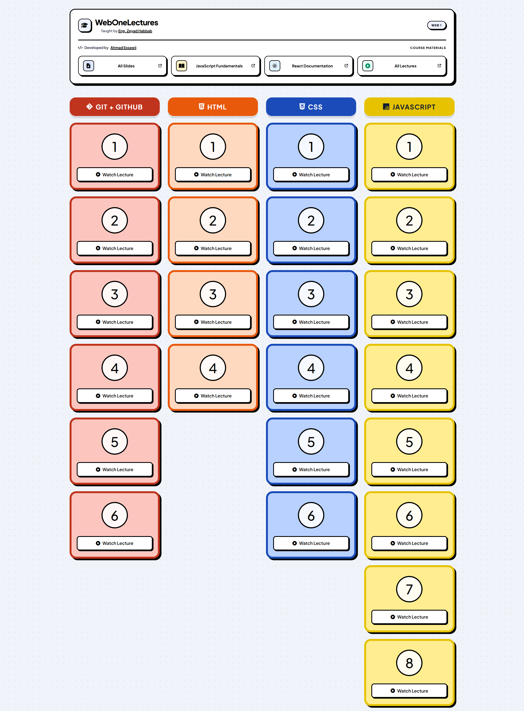

# 🌐 WebOneLectures — Web Development Learning Resources

**Your central hub for Web 1 lectures, slides, and essential web development resources — all in one place.**

👨‍🏫 **Instructor:** Eng. Zeyad Habbab  
📚 **Course:** Web 1  
📅 **Academic Year:** 2025 - 2026  
👨‍💻 **Developer:** Ahmad Essawii


---

## 🚀 Live Demo

Explore the website and access course materials, lecture resources, and useful references in one organized place.

[](https://ahmadessawii06.github.io/Web1-Zeyad-Lectures/)

---

## 🖼️ Preview



---

## ✨ Features

- 📚 **Course Materials:** Quick access to Web 1 learning materials.
- 🗂️ **Slides Collection:** Access slides covering Git, HTML, and CSS.
- 📖 **JavaScript Fundamentals:** A dedicated resource for learning JavaScript basics.
- ⚛️ **React Documentation:** Direct access to the official React learning resources.
- ▶️ **All Lectures:** Open the complete lecture collection on Google Drive.
- 📱 **Responsive Design:** A clean experience across desktop and mobile devices.
- 🎨 **Modern UI:** A simple, organized interface designed for easy navigation.


## 🛠️ Tech Stack

Built with standard web technologies:

- **HTML5** — Page structure and content.
- **CSS3** — Styling, layout, and responsive design.
- **JavaScript** — Dynamic behavior and interactivity.
- **Font Awesome** — Interface icons.
- **Google Fonts** — Modern typography.
- **GitHub Pages** — Website hosting and deployment.

No frontend framework or build step is required if the project uses the current plain HTML, CSS, and JavaScript setup.

---

## 📁 Project Structure

```text
Web1-Zeyad-Lectures/
├── assets/
│   └── demo.png
│   └── favicon.svg
├── scripts/
│   └── components.js
│   └── lectures.js
│   └── main.js
├── styles/
│   └── style.css
├── index.html
└── README.md
```


---

## 💻 Run Locally

Clone the repository:

```bash
git clone https://github.com/ahmadessawii06/Web1-Zeyad-Lectures.git
```

Open the project folder:

```bash
cd Web1-Zeyad-Lectures
```

Then open `index.html` in your browser, or use the **Live Server** extension in Visual Studio Code.

---

## 🎯 Project Goal

Web1 Hub was created to make accessing Web 1 learning resources easier by bringing lectures, slides, and useful documentation together in one convenient place.

The goal is to reduce the time spent searching for materials and provide a simple, organized learning experience.

---

## 👨‍💻 Author

Developed by **[Ahmad Essawii](https://github.com/ahmadessawii06)**

Course instructor: **[Eng. Zeyad Habbab](https://github.com/zeiadhabbab)**

---

<p align="center">
  <sub>Built for learning, organized for simplicity.</sub>
</p>
